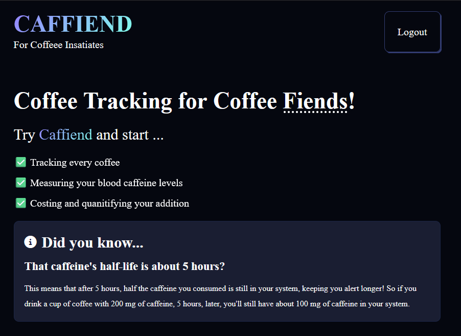
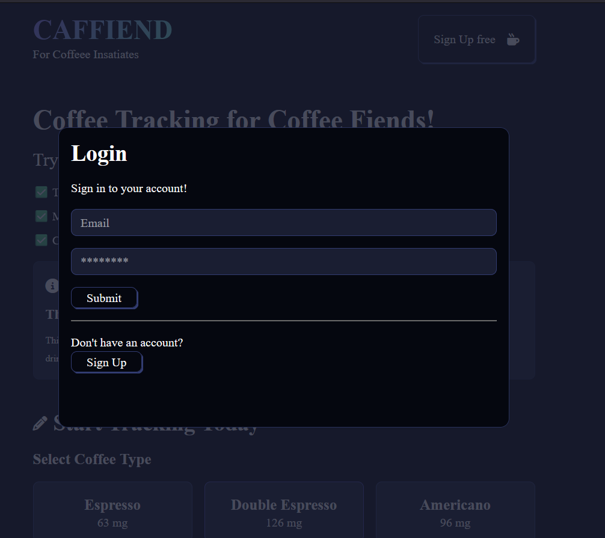
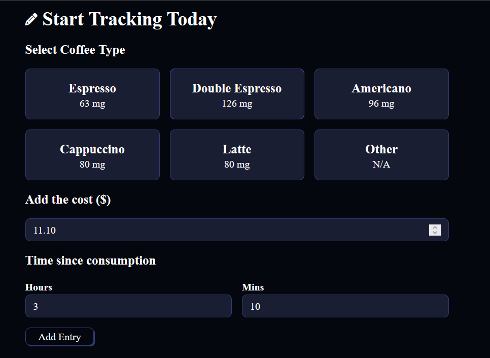
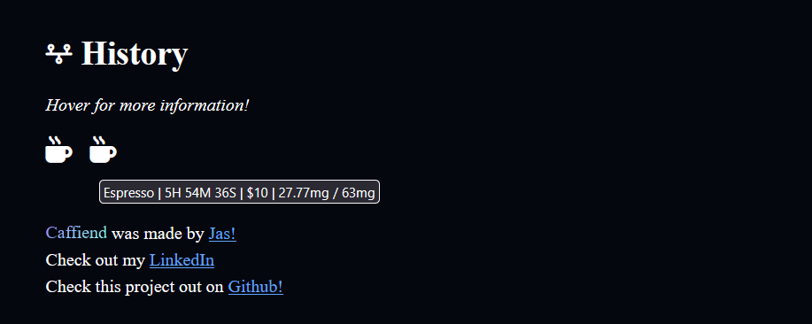
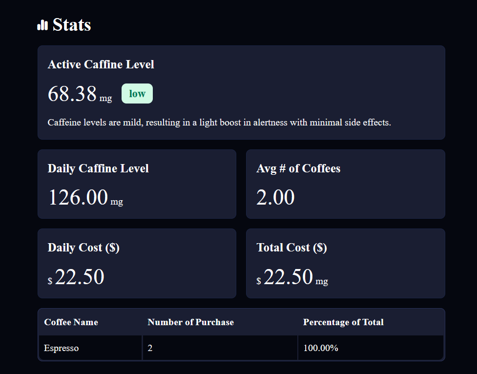

# Caffiend – Coffee Tracking App

Caffiend is a web application for coffee enthusiasts that allows you to track every cup of coffee you drink, monitor your caffeine levels over time, and keep track of the cost of your daily coffee habit. Built with React and Firebase, Caffiend features user authentication, interactive forms, detailed consumption history, and real-time statistics to help you better understand your caffeine intake.

---

## Table of Contents

- [Features](#features)
- [Technologies Used](#technologies-used)
- [Project Structure](#project-structure)
- [Installation & Setup](#installation--setup)
- [Usage](#usage)
- [Screenshots](#screenshots)
- [Contributing](#contributing)
- [License](#license)
- [Acknowledgments](#acknowledgments)

---

## Features

- **User Authentication:**  
  Secure registration and login using Firebase Authentication. Toggle between login and registration modes within a responsive modal.

- **Coffee Tracking:**  
  Easily select a coffee type from preset options or choose an alternative type. Input the cost and specify the time elapsed since consumption.

- **Real-time Data Storage:**  
  Submit your coffee entry to update both the local state and persist your data on Firebase Firestore.

- **Consumption History:**  
  View a timeline of your coffee entries. Hover over each entry for a quick summary including coffee name, time since consumption, cost, and caffeine levels.

- **Statistics Dashboard:**  
  Analyze your coffee consumption with statistics such as:

  - Active and daily caffeine levels
  - Average number of coffees per day
  - Daily and total cost
  - A breakdown of the top three coffee choices

- **Responsive & Interactive UI:**  
  Enjoy a modern interface with modals, interactive forms, and dynamic feedback for both authentication and data entry.

---

## Technologies Used

- **React:** For building interactive user interfaces.
- **Firebase:**
  - **Authentication:** To handle user signup, login, and session management.
  - **Firestore:** For storing and syncing user coffee data in real time.
- **Context API:** To manage global state across components (e.g., authentication state and coffee tracking data).
- **JavaScript (ES6+):** For application logic.
- **CSS & Font Awesome:** For styling and icons.

---

## Project Structure

Below is an overview of the main components and files:

- **Authentication Component:**  
  Handles user registration and login. Uses React hooks to manage form state and integrates with the `useAuth` context for Firebase interactions.

- **CoffeeForm Component:**  
  Provides a form to track coffee consumption. It allows users to select a coffee type, enter cost details, and specify how long ago the coffee was consumed. It creates a timestamp-based record and updates the global state and Firestore.

- **Hero Component:**  
  Serves as the landing page section that highlights the app’s benefits, fun facts (like caffeine half-life), and a welcoming message for coffee fiends.

- **History Component:**  
  Displays the user's coffee consumption history in a timeline format. Each entry shows details about the coffee type, cost, and calculated caffeine levels.

- **Stats Component:**  
  Presents a dashboard of statistics including active caffeine levels, daily caffeine, average coffees, and cost summaries. Also features a table of the top three coffee choices.

- **Layout Component:**  
  Wraps the overall app structure. Contains the header (with conditional sign-up/login or logout), main content area, and footer with creator and project links.

- **Modal Component:**  
  Implements a portal-based modal to display the authentication form. Ensures a smooth UX when users need to log in or register.

- **Utilities (from `/utils`):**  
  Contains helper functions such as:
  - `calculateCurrentCaffeineLevel`
  - `calculateCoffeeStats`
  - `getTopThreeCoffees`
  - `timeSinceConsumption`
  - A list of `coffeeOptions`

---

## Installation & Setup

1. **Clone the Repository:**

   ```bash
   git clone https://github.com/Arbiter09/Caffiend.git
   cd Caffiend
   ```

````

2. **Install Dependencies:**
   Ensure you have Node.js and npm installed. Then run:

   ```bash
   npm install
   ```

3. **Firebase Configuration:**

   - Create a new Firebase project in the [Firebase Console](https://console.firebase.google.com/).
   - Enable **Authentication** (Email/Password) and **Firestore**.
   - Copy your Firebase configuration settings.
   - Create a file (if not already present) such as `firebase.js` in your project root or `/src` and add your Firebase initialization code:

     ```js
     import { initializeApp } from "firebase/app";
     import { getFirestore } from "firebase/firestore";

     const firebaseConfig = {
       apiKey: "YOUR_API_KEY",
       authDomain: "YOUR_AUTH_DOMAIN",
       projectId: "YOUR_PROJECT_ID",
       storageBucket: "YOUR_STORAGE_BUCKET",
       messagingSenderId: "YOUR_MESSAGING_SENDER_ID",
       appId: "YOUR_APP_ID",
     };

     const app = initializeApp(firebaseConfig);
     export const db = getFirestore(app);
     ```

4. **Run the Application:**
   Start the development server with:

   ```bash
   npm run dev
   ```

   Then, open your browser to [http://localhost:5173](http://localhost:5173).

---

## Usage

- **Authentication:**
  When you first visit the app, click on the "Sign Up free" button to open the modal. You can switch between "Sign Up" and "Login" modes. After a successful authentication, the modal will close.

- **Tracking Coffee Consumption:**
  Navigate to the coffee tracking form. Select your coffee type (or choose "Other" for additional options), enter the cost, and specify the time since consumption (hours and minutes). Click "Add Entry" to record your coffee.

- **Viewing History & Stats:**
  - The **History** section displays a timeline of your coffee entries. Hover over each icon for a summary of details.
  - The **Stats** section gives you an overview of your caffeine levels and spending habits, helping you stay informed about your coffee consumption.

---

## Screenshots

### Hero Component



### Login Modal



### Coffee Tracking Form



### History Timeline



### Statistics Dashboard



---

## Contributing

Contributions are welcome! If you’d like to help improve Caffiend:

1. Fork the repository.
2. Create a new branch for your feature or bug fix:
   ```bash
   git checkout -b feature/YourFeatureName
   ```
3. Commit your changes.
4. Push to your branch:
   ```bash
   git push origin feature/YourFeatureName
   ```
5. Open a pull request.

---

## License

This project is licensed under the MIT License. See the [LICENSE](LICENSE) file for details.

---

## Acknowledgments

- Special thanks to [Jas](https://github.com/Arbiter09) for the development of this project.
- Inspiration from the everyday challenges of tracking caffeine consumption and making smarter coffee choices.
- Additional thanks to the open-source community for libraries and tools that make this project possible.

---

Enjoy tracking your coffee habits with Caffiend and stay caffeinated responsibly!

```

```
````
